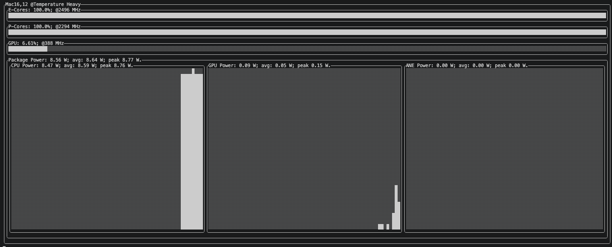

# Antop

Antop is a lightweight, high-performance macOS CLI tool for monitoring system power and CPU metrics in real-time. Built in Swift, it is designed to be energy-efficient, memory-safe, and blazing fast, replacing the need for heavy Python-based alternatives.


## 🚀 Project Status

* This is the initial phase of the project. The main goal is to:
	* ✅  Stream powermetrics data in real-time.
	* ✅  Parse and process metrics incrementally.
	* ✅  Present the relevant graphs in terminal.
	* ✅  Efficient Hawk-TUI implementation.
	* 🤔  Parameterise Executable. 

## 💡 Why Antop?

* Existing tools often:
	*	Dump massive XML/PLIST logs to disk
	*	Reparse everything repeatedly
	*	Consume growing amounts of memory and CPU

Antop addresses these issues by streaming and processing data incrementally, using Swift for both speed and energy efficiency.

## Current Progress....


## 🙏 Appreciation

A huge thank you to everyone who supports, inspires, or provides feedback on this project. Your encouragement keeps this initiative moving forward.

## 📦 Coming soon...
*   Power graphs.
*	Homebrew distribution for easy installation

## 🛠️ How to Run (Development)

### Clone the project
```bash
git clone https://github.com/anantashahane/antop.git
cd antop/antop-cli
```
###  Build and run
* ⚠️ `powermetrics` requires sudo, so you may need:
  ```
  sudo swift run
  ```


## 📝 Contribution

This project is in early development. Contributions, feedback, or suggestions are welcome!

---
